## GUI's met TkInter

We zijn van start gegaan met het schrijven van console-applicaties.  
Met hulp van de input() en print()-functies waren we in staat van de applicaties wat **interactief** te maken

Met behulp van TkInter gaan we grafische applicaties of GUI's maken (GUI = **G**raphical **U**ser **I**nterface)

### Leeg scherm

We starten met een éénvoudige applicatie: 

~~~python
from tkinter import *
window = Tk()
window.mainloop()
~~~

Je dient hiervoor de module tkinter te importeren, vervolgs maak je tkinter-object (dat het scherm/window voorstelt).

Als laatste lijn van deze code roep je de mainloop()-functie aan.  
Deze zal de GUI starten en in de background een oneindige loop draaien, die er voor zorgt dat dit scherm-programma actief blijft.

Als resultaat krijg je dan een lege applicatie.

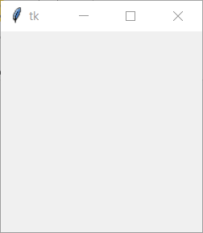

Deze kan je minimaliseren, maximaliseren en sluiten (via het kruisje) zoals een standaard GUI-applicatie.

> Let wel, het uizicht van scherm kan licht varieren afhankelijk van het operating-system.

### Leeg scherm met titel

Om een titel toe voegen...

~~~python
from tkinter import *
window = Tk()
window.title("Let's make some gui")
window.mainloop()
~~~

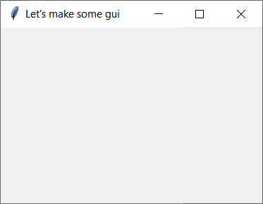

### Label

Deze GUI bestaat uit 2 onderdelen:

* De **titelbalk** (titel en acties)
* De **canvas** waar je **grafische elementen** kan plaatsen

~~~python
from tkinter import *
window = Tk()
window.title("Let's make some gui")
lbl = Label(window, text="Hello gui")
lbl.pack()
window.mainloop()
~~~

Zo'n eerste element dat je kan plaatsen is een **label**, dit is een stuk tekst (dat je programmatorisch kan manipuleren)

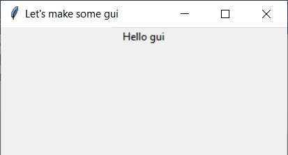

### button

Een meer **interactief component** dat je op een canvas kan zetten is een **button**

~~~python
from tkinter import *
import sys
window = Tk()
window.title("Let's make some gui")
lbl = Label(window, text="Hello gui")
lbl.pack()
button = Button(window, text="Goodbye", command=sys.exit)
button.pack()
mainloop()
~~~

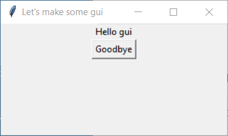

### Font-size aanpassen

~~~python
from tkinter import *
import sys
window = Tk()
window.title("Let's make some gui")
lbl = Label(window, text="Hello gui", font=("Arial Bold", 40))
lbl.pack()
button = Button(window, text="Goodbye",bg="black", fg="white", command=sys.exit)
button.pack()
mainloop()
~~~

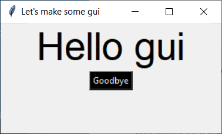

### Grootte van het scherm aanpassen

~~~python
from tkinter import *
import sys
window = Tk()
window.title("Let's make some gui")
window.geometry('500x300')
lbl = Label(window, text="Hello gui", font=("Arial Bold", 40))
lbl.pack()
button = Button(window, text="Goodbye",bg="black", fg="white", command=sys.exit)
button.pack()
mainloop()
~~~

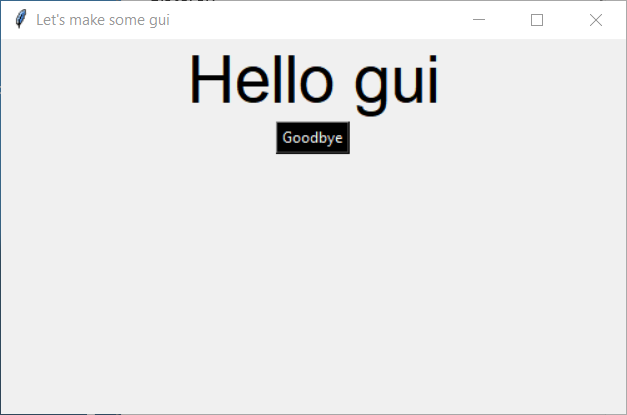

### Een actie koppelen aan aan een button (1)

~~~python
from tkinter import *
import sys

def clicked():
     lbl.configure(text="Button was clicked !!")

window = Tk()
window.title("Let's make some gui")
window.geometry('350x200')
lbl = Label(window, text="Hello gui", font=("Arial Bold", 20))
lbl.pack()
button = Button(window, text="Goodbye",bg="black", fg="white", command=sys.exit)
button.pack()
message_button = Button(window, text="Message",bg="white", fg="black", command=clicked)
message_button.pack()
mainloop()
~~~

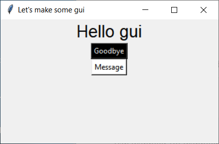

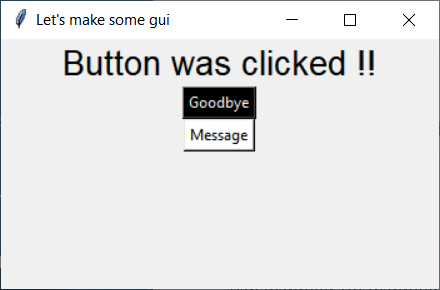

### Een actie koppelen aan aan een button (2)

~~~python
from tkinter import *
import sys

def clicked():
     lbl.configure(text="Message: " + txt.get())

window = Tk()
window.title("Let's make some gui")
window.geometry('350x200')
lbl = Label(window, text="Hello gui", font=("Arial Bold", 20))
lbl.pack()
button = Button(window, text="Goodbye",bg="black", fg="white", command=sys.exit)
button.pack()
message_button = Button(window, text="Message",bg="white", fg="black", command=clicked)
message_button.pack()
txt = Entry(window,width=10)
txt.pack()
mainloop()
~~~

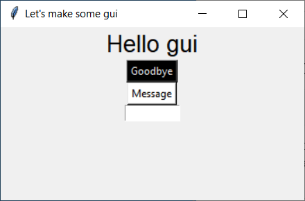

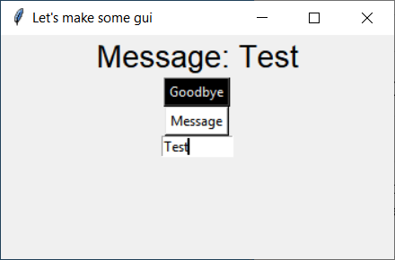

### Dropdown

~~~python
from tkinter import *
from tkinter.ttk import *
import sys

def clicked():
     lbl.configure(text="Message: " + combo.get())

window = Tk()
window.title("Let's make some gui")
window.geometry('350x200')
lbl = Label(window, text="Hello gui", font=("Arial Bold", 20))
lbl.pack()
button = Button(window, text="Goodbye", command=sys.exit)
button.pack()
message_button = Button(window, text="Message", command=clicked)
message_button.pack()
combo = Combobox(window)
combo['values']= (1, 2, 3, 4, 5, "Text")
combo.current(1) #set the selected item
combo.pack()
mainloop()
~~~

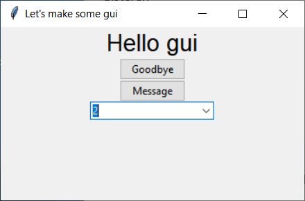

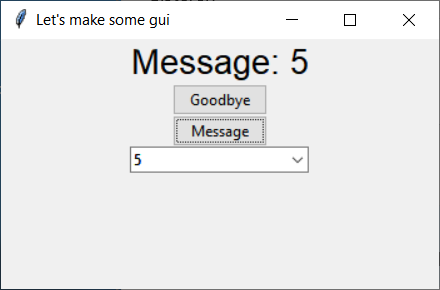
