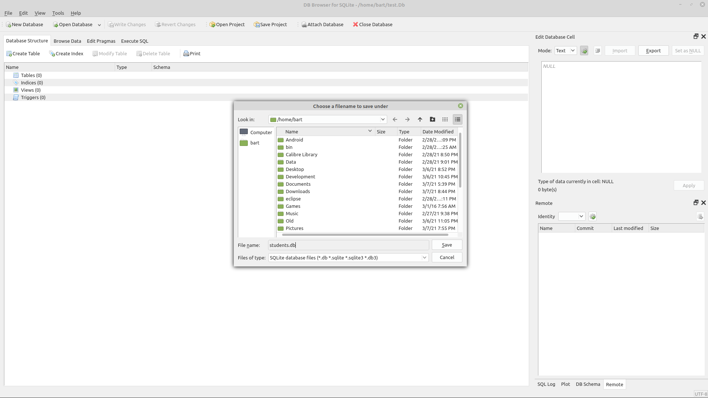
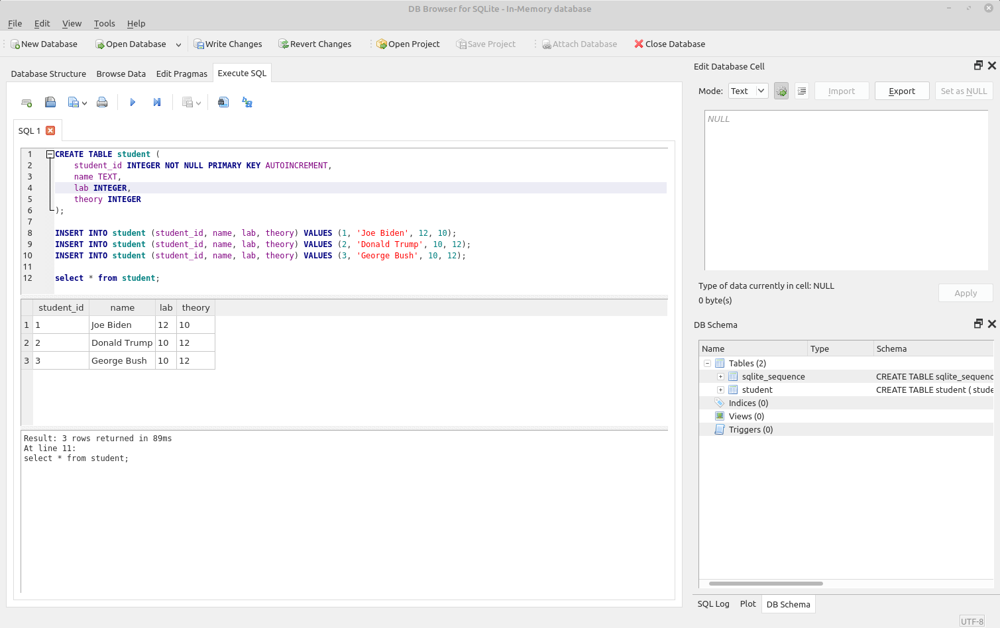

## Werken met een embedded database: Sqlite Primer

### "Getting started" met SQL

Als vervolg gaan we nu leren werken relationele databases

* Als **eerste stap** is leren **werken met SQL**, hier voor gebruiken we een sql-browser-tool
* Vervolgens gaan we een **database** gebruiken vanuit **Python** door middel van een **api** 

### Sqlite (een relationele database in praktijk)

Eerder maakten we melding van het **verschil** tussen **client-server** en **embedded databases**.  
In dit deel van de cursus (kennismaking met sql) gaan we gebruik maken van een **embedded database** vanwege de **gebruiksvriendelijkheid** en de **snelheid van ontwikkeling**.  

We kiezen hier voor **Sqlite**, een veel (meest) gebruikte embedded database (zie ook https://www.sqlite.org/index.html).  
Deze wordt binnen de industrie gebruikt door verschillende toepassingen:

* Storage voor Android-systeem en -applicaties
* Office-toepassingen
* CAD-systemen
* History voor internetbrowsers
* Embedded Systemen
* Configuratie van desktop-toepassingen
* Educationele redenen als deze applicatie
* ...

### Sqlitebrowser

Om met Sqlite te werken starten we met het gebruik van een handige tool om sql-commando's toe te passen op deze database.

Download sqlitebrowser vanaf https://sqlitebrowser.org/ of via de packagemanager van je Linux-distro.  

### Database aanmaken met Sqlite

Zo'n sqlite-database betaat uit **1 file**, meestal met de extensie **db**.  

Onze eerste stap is zo'n nieuwe database aan te maken, hiervoor open je de sqlite-browser die we eerder hebben gedownloaded

Binnen dit scherm selecteer je linksboven de optie nieuwe database (zie screenshot)

Bij het bewaren geef je deze de naam **students.db** (meest gebruikte extensie voor sqlite-databases)

### Werken met SQL in Sqlite

Als je vervolgens de database wil gebruiken om data op te slagen of te ondervragen kan je hiervoor SQL gebruiken.  
SQL is - zoals we in het volgende deel gaan zien - manier om te interageren met een relationele database via een sql-statements (of meerdere statements via een sql-script).  

We komen zo dadelijk terug op SQL zelf, hier willen enkel demonstreren eerst hoe we zulk en script via sqlitebrowser kunnen uitvoeren, gezien we dit nog veelvuldige gaan nodig hebben.

Gegeven het volgend voorbeeld SQL-script:

> *Nota:* als je hier nog niet met mee bent, dit wordt in het volgende deel uitgelegd.

~~~sql
CREATE TABLE student (
	student_id INTEGER NOT NULL PRIMARY KEY AUTOINCREMENT,
	name TEXT,
	lab INTEGER,
	theory INTEGER
);

INSERT INTO student (student_id, name, lab, theory) VALUES (1, 'Joe Biden', 12, 10);
INSERT INTO student (student_id, name, lab, theory) VALUES (2, 'Donald Trump', 10, 12);
INSERT INTO student (student_id, name, lab, theory) VALUES (3, 'George Bush', 10, 12);

select * from student;
~~~

We gaan hier wel van uit dat je een bestaande database-file hebt geopend of hebt gecreerd.
Om **SQL-scripts** uit te voeren selecteer je de tab "Execute SQL".  

Binnen dit venster kan je dan SQL-commando's (of queries) typen om je database te ondervragen (select) of te wijzigen (insert, update, delete).  

* Copieer het script hierboven in de sql-editor zoals hieronder geillustreerd
* Druk op de play-button onder de tab

Na het uitvoeren zie je onderaan 2 belangrijke vensters.  
Allereerst zie je een venster dat aangeeft of je script goed of slecht is uitgevoerd:

~~~
Result: 3 rows returned in 89ms
At line 11:
select * from student;
~~~

Daarboven zie je ook - in tabulaire vorm - het resultaat van de laatste statement...

~~~sql
select * from student;
~~~

dat de inhoud van de tabel student weergeeft

~~~
student_id  name                lab          theory
----------  ----                ---          ------
1           Joe Biden           12           10
2           Donald Trump        10           12
3           George Bush         10           12
~~~

In het volgende deel gaan we deze sql-syntax onder de loep nemen.

