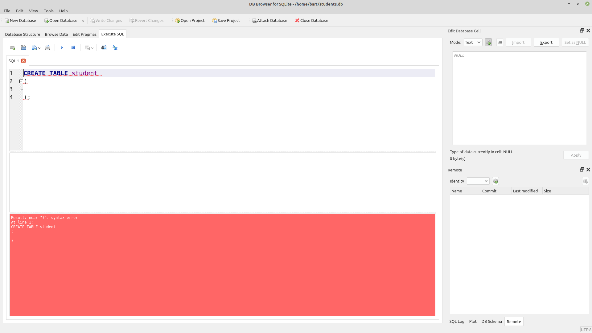
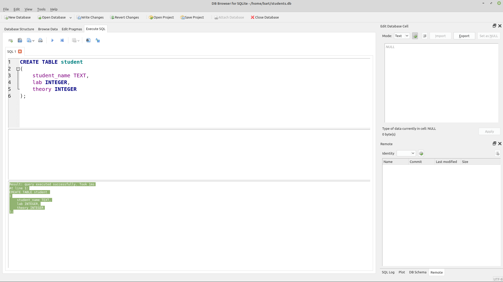
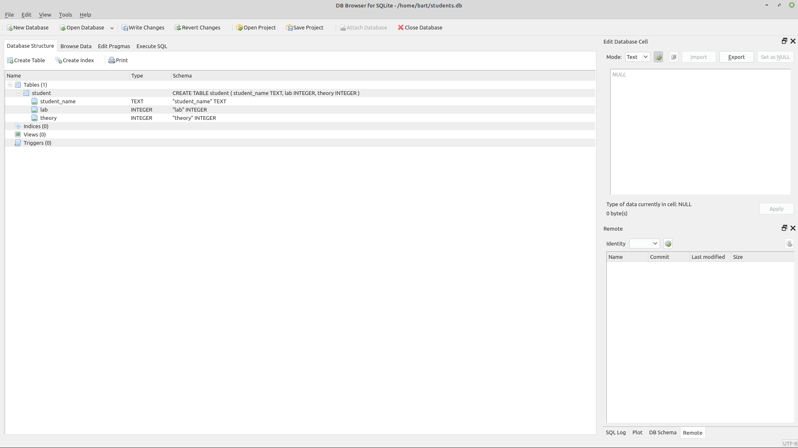
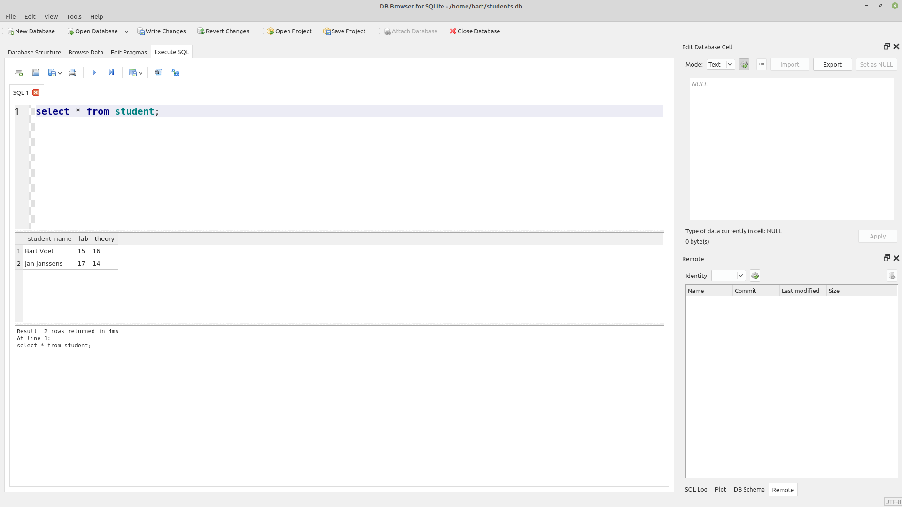

## Werken met SQL

### "Getting started" met SQL

Om te kunnen werken met een (relationele) database heb je dus SQL nodig, we gaan dat doen in 2 trappen:

#### SQL via de sqlitebrowser

Om een goed begrip te krijgen van SQL, gaan we eerst leren **werken met SQL**.  
Hiervoor gebruiken we de sqlitebrowser-tool om tabellen aan te maken, data te manipuleren en op the halen.

~~~
+-------------------+------------+----------------+
|                   |            |                |
|                   +----------->|                |
|                   |    SQL     |                |
|   Sqlitebrower    |            |    Database    |
|                   |    DATA    |                |
|                   |<-----------+                |
|                   |            |                |
+-------------------+------------+----------------+
~~~

#### SQL vanuit een Python-applicatie

Vervolgens gaan we een **database** sturen/gebruiken vanuit **Python**, waar we door middel van een **API** waarme we deze SQL-commando's gaan sturen.

~~~
+---------------+---+------------+----------------+
|               |   |            |                |
|               |   +----------->|                |
|               | A |    SQL     |                |
|  Applicatie   | P |            |    Database    |
|               | I |    DATA    |                |
|               |   |<-----------+                |
|               |   |            |                |
+---------------+---+------------+----------------+
~~~

### Wat is SQL?

SQL of **Structured Query Language** is een taal die we gebruiken om met een **database** te praten.  
Deze SQL-taal is onderverdeeld in 3 delen:

* **DDL** - Data Definition Language  => Beschrijven van datastructuren in ons geval tabellen
* **DML** - Data Modification Language => Ondervragen en wijzigen van data
* **DCL** - Data Control Language => Controleren van toegang tot de data

We gaan ons grotendeels bezig houden met **DML** om de inhoud van de database te wijzigen en te consulteren.  
We gaan echter van start met DDL om tabellen te definieren waarin we onze data gaan opslaan.

#### ANSI/ISO-standaard

SQL is ook een **ANSI/ISO-standaard** die ondersteund wordt door **diverse** **databasemanagementsystemen** (DBMS).  
Alle moderne (relationele) databaseproducten gebruiken vandaag dezelfde taal om data te definieren en te manipulere.  
Wel dient er op gewezen worden dat vele system wel **eigen uitbreidingen of dialecten** voorzien...

#### Declaratieve programmeer-taal

SQL wordt ook bekeken als een programmeertaal, maar het is zeker geen programmeer-taal zoals we deze hebben gezien met Python.  

SQL is wat ze noemen een **declaratieve programmeertaa**l, je **beschrijft** eerder **welke data** je wil hebben.  
Dit in tegenstelling tot **imperatieve** programmeertalen waar je ook beschrijft **hoe** je deze wil verkrijgen (adhv van variabelen, condities, loops, ...)

#### SQL-statements en -scripts

SQL maakt gebruik van verschillende soorten statements zoals we gaan zien:

* **create-** en **drop-statements** om tabellen aan te maken (DDL)
* **select-statements** of **queries** om data op te halen
* **insert-** en **update-** en **delete-**statements om de data op te halen

Een voorbeeld hieronder is een select-statement om gegevens op te halen uit een de studenten-tabel.

~~~sql
select * from student;
~~~

Deze statements worden bijna altijd ook beeindigd met een **;**, dit is zeker van belang als je met SQL-scripts werkt je meerdere statements combineert om uit te voeren.

In onderstaand voorbeeld voeren we 3 insert-statements in 1 script uit.  

~~~sql
INSERT INTO student (student_id, name, lab, theory) VALUES (1, 'Joe Biden', 12, 10);
INSERT INTO student (student_id, name, lab, theory) VALUES (2, 'Donald Trump', 10, 12);
insert into student (student_id, name, lab, theory) values (3, 'George Bush', 10, 12);
~~~

> Nota: merk ook op dat deze taal case-insentive is, de laatste statement van vorige block is in lower-case geschreven ter verduidelijking

Om de verschillende statements van elkaar te kunnen onderscheiden dienen deze dan ook gescheiden te worden van elkaar doormiddels van een **;**

### DDL => Tabellen aanmaken

Alvorens de database te kunnen gebruiken dien je echter eerst tabellen aan te maken voor je deze kan gebruiken, dus we gaan van **start** met **create-statements**.

In de eerdere hoofdstukken hadden we een studenten-applicatie gemaakt, we gaan hier op verder bouwen om SQL te kunnen demonstreren.  
We gaan van start met een tabel aan te maken om **studenten-data op te slaan** 

Deze tabel zal dan de data bevatten van, ter herhaling de klasse student bevatte 3 velden:

* Naam
* Labo-punten
* Theorie-punten

Deze velden gaan we aanmaken binnen een **tabel** en noemen we ook wel een **kolom**.  
Een  tabel bestaat uit:

* Kolommen of de velden die zo'n tabel bevat (projectie)
* Rijen van data, in het voorbeeld hieronder bevat de tabal al 2 lijnen or rijen met studenten-data

~~~
+---------------+---------------+---------------+
| student_name  |      lab      |     theory    |
+---------------+---------------+---------------+  
|  Bart Voet    |      15       |      16       |
+---------------+---------------+---------------+  
| Jan Janssens  |      17       |      14       |
+---------------+---------------+---------------+
~~~

#### CREATE TABLE

##### Poging 1 (zonder velden)

Om deze structuur aan te namen gebruiken we een create-statement:

* Dit start met de **"create table"**
* Gevolgd door een **naam** voor deze structuur (student in dit geval)
* Gevolgd door **haakjes-paar**
* En gevolgd door een **;**

> Nota: sql is wat betreft syntax (niet data) case-insensitive...

~~~sql
CREATE TABLE student 
(

);
~~~

We klikken vervolgens op de play-button om dit statement uit te voeren ... en we krijgen een error

Deze error is normaal want dit is nog **geen geldig statement**, een tabel moet echter **minstens** **1 kolom**/veld bevatten.

~~~
Result: near ")": syntax error
At line 1:
CREATE TABLE student 
(

)
~~~

##### Poging 2 (met velden)

Deze velden kan je toevoegen tussen de haakjes:

* Zijn gescheiden door komma's
* Bevatten een type (text of integer)

(er zijn vanzelfsprekend meerdere types maar we beperken ons voorlopig hier toe)

~~~sql
CREATE TABLE student 
(
    student_name TEXT,
    lab INTEGER,
    theory INTEGER
);
~~~

Deze poging is successvol en duidt aan dat de tabel is gecreerd:

~~~
Result: query executed successfully. Took 1ms
At line 1:
CREATE TABLE student 
(
    student_name TEXT,
    lab INTEGER,
    theory INTEGER
);
~~~

Als je navigeert naar de **tab "Database Structure"** zie je ook dat deze tabel is **aangemaakt**.

#### DROP TABLE: Tabellen verwijderen

Een andere DDL-statement (naast create) is **drop**.  
Dit kan men gebruiken om een tabel te verwijderen uit een database.

We gaan dit vervolgens doen om daarna de tabel terug aan te maken (om primary en foreign keys te demonsteren)

~~~sql
drop table student;
~~~

Als je dan probeert de tabel te querien krijg je de melding geen data meer te hebben.

~~~
sqlite> select * from student;
Error: no such table: student
~~~

> **Waarschuwing:**  Let wel, dit verwijdert zowel de definitie als de data en is onherroepbaar!!!

### Data manipuleren (DML)

Met de voorgaande operaties (**DDL**) kunnen we dus tabellen **definieren**.  
Om de data er in te krijgen in te vullen hebben we DML nodig.

#### CRUD

Algemeen bij het werken met data spreken we dikwijls van CRUD
CRUD staat voor de vier **basisoperaties** die op date uitgevoerd kunnen worden zoals:

* **Create** (of insert): Toevoegen van nieuwe data.
* **Read** (of select): Opvragen van gegevens.
* **Update**: Wijzigen van gegevens.
* **Delete**: Verwijderen van gegevens.

De vertaing van deze CRUD-operaties gebeurt binnen SQL via DML-statements

#### Data toevoegen via het insert-statement

We keren hiervoor terug naar het sql-venster om te zien hoe we **data** moeten **toevoegen** aan een **tabel**.  
Hiervoor gebruiken we het insert-statement zoals hieronder geillustreerd en we **voeren dit uit**:

~~~sql
insert into student(student_name,lab,theory) values("Bart Voet",15,16);
~~~

Als dit **successvol** is krijg je een vergelijkbare **output** zoals **hieronder**:

~~~
Result: query executed successfully. Took 0ms, 1 rows affected
At line 1:
insert into student(student_name,lab,theory) values("Bart Voet",15,16)
~~~

Dit **insert-statement** bestaat uit:

* De **keyword**-combo **insert into**
* Gevolgd door de **tabel-naam** student
* De **velden** die je wil **updaten** (tussen de haakjes gescheiden door komma's)
* Gevolgd door de het **keyword** **values**
* En daarna de **waarden** tussen **haakjes** die je wil injecteren, ook **gescheiden door komma's** (zoals bij de kolomnamen)

Bemerk ook dat **string** hier ook worden gemarkeerd door **quotes**, net zoals we in Python gewoon zijn.  
Om de volgende stappen te doen voegen we nog een **2de rij** toe aan de database via:

~~~sql
insert into student(student_name,lab,theory) values("Jan Janssens",17,14);
~~~

met als **restulaat**

~~~
Result: query executed successfully. Took 0ms, 1 rows affected
At line 1:
insert into student(student_name,lab,theory) values("Jan Janssens",17,14);
~~~

#### Data lezen via het select-statement

Om de data (die we zojuist hebben geinjecteerd) te kunnen **lezen** gebruiken we een 2de soort SQL-statements, namelijk **select-statements** of korter gezegd **queries**.  
Typ het volgende statement in de sql-editor:

~~~sql
select * from student;
~~~

Deze bestaat uit 3 onderdelen:

* "select"-keyword
* een \* om aan te gevan dat je **alle velden** wil selecteren

Als dit succesvol is krijg je data zien zoals hieronder:

De data die je ziet in het raster stemt dan overeen met de date die je hebt toegevoegd via de voorgaande **insert-statements**

~~~
student_name  lab         theory    
------------  ----------  ----------
Bart Voet     15          16        
Jan Janssens  17          14  
~~~

#### Beperken van de velden (projectie)

Het \*-symbool zal er voor zorgen dat **alle velden** worden **geprojecteerd** in de uitkomst.  

Als je echter niet alle velden nodig hebt kan je ook de **velden projecteren** die **je wil zien** **gescheiden** door een **komma** (ipv een) \*)

~~~sql
select student_name, lab from student;
~~~

In dit geval zal je zien dat enkel de naam en de de labo-punten worden **geprojecteerd**

~~~
student_name  lab       
------------  ----------
Bart Voet     15        
Jan Janssens  17
~~~

Dit bepalen of beperken van de kolommen is wat we noemen een **projectie**, dit houdt in welke kolommen of velden je wil tonen.

#### Gebruik van where-clausules (selectie)

Naast de **projectie** kunnen we ook het aantal rijen beperken in het resultaat door middel van **selectie** (of filteren).  

Dit doen we via een **where-clausule** toe te voegen...  
We passen bijvoorbeeld de vorige query aan om de studenten te selecteren met meer dan 16 punten

~~~sql
select student_name, lab from student where lab > 16;
~~~

Het resultaat wordt **gefilterd** en we krijgen **enkel de student** te zien met **meer dan 16 punten**.

~~~
student_name  lab       
------------  ----------
Jan Janssens  17  
~~~

Dit filteren of beperken van het aantal rijen is wat we noemen binnen **SQL** (en relationele algebra) een **selectie**.  
Je kan voor dit filteren verschillende operatoren gebruiken zoals:

~~~
=	Gelijk aan	
>	Groter dan	
<	Kleiner dan	
>=	Groter dan of gelijk aan
<=	Kleiner dan of gelijk aan	
<>	Niet gelijk aan
~~~

Deze zijn  - met **uitzondering** van **<>** dat overeenkomt met != in Python - **hetzelfde** zoals je deze in **Python-code** zou gebruiken voor condities en loops.  
Als je de statement omdraait... (minder dan 16 ipv meer)

~~~sql
select student_name, lab from student where lab < 16;
~~~

... krijg je dan ...

~~~
student_name  lab       
------------  ----------
Bart Voet     15    
~~~

#### where combineren met and of or

Om de volgende oefeningen te kunnen verder zetten voegen we eerst nog wat rijen toe:

~~~sql
insert into student(student_name,lab,theory) values("Piet Pieters",9,12);
insert into student(student_name,lab,theory) values("Joris Jorissen",11,12);
~~~

Je kan (net zoals in Python) ook **condities** **combineren** met **and** of **or**.  
Bijvoorbeeld willen we de studenten die meer (of gelijk) aan 15 op hun theorie hebben...

~~~sql
select student_name, lab from student where lab > 14 or theory >= 14;
~~~

...krijg je meer studenten geselecteerd (die zowel op labo als theorie hoger scoren als 14):

~~~
student_name  lab       
------------  ----------
Bart Voet     15        
Jan Janssens  17  
~~~

De 2 nieuwe studenten krijg je niet te zien, als we nu een combineren met **and** om de studenten te zien die zowel op theorie als labo minder hebben dan 14...

~~~sql
select student_name, lab, theory from student where lab < 14 and theory < 14;
~~~

... krijg je ...

~~~
student_name  lab         theory    
------------  ----------  ----------
Piet Pieters  9           12        
Joris Joriss  11          12    
~~~

#### Data bewerken met update

Tot nog toe kunnen we:

* Een tabel aanmaken met een **create-statement**
* Data injecteren met **insert-statements**
* Data ophalen via **select** 
* Filteren via een **where-clausule**

Wat als je data wil **aanpassen** in een **bestaande rij**, dit kan je via een update-statement.

~~~sql
update student set lab = 10 where student_name = "Piet Pieters";
~~~

Als we nadien de tabel bekijken zien we dat de betreffende student (Piet Pieters) zijn labo-punten zijn aangepast (9 -> 10)

~~~
student_name  lab         theory    
------------  ----------  ----------
Bart Voet     15          16        
Jan Janssens  17          14        
Piet Pieters  10          12        
Joris Joriss  11          12  
~~~

De syntax is hier:

* keyword **update**
* gevolgd door de **tabel-naam**
* dan het keyword **set**
* gevolgd door de eigenlijke update met de vorm **column-name = waarde**
* en als laaste een **where-conditie** die aangeeft welke rijen moeten worden geupdated

> **Waarshuwing:**  
> Als je deze where-conditie of clausule vergeet loop je het **risico** alle rijen aan te **passen**

#### Update meerdere velden

Je kan ook **meerdere velden tegelijk** updaten, hiervoor voeg je een nieuw update-veld/onderdeel toe (gescheiden door een komma)

~~~sql
update student set lab = 16, theory=15 where student_name = "Jan Janssens";
~~~

Hier wordt zowel het labo als de theorie van Jan Janssens aangepast.

~~~
student_name  lab         theory    
------------  ----------  ----------
Bart Voet     15          16        
Jan Janssens  16          15        
Piet Pieters  10          12        
Joris Joriss  11          12   
~~~

#### Update meerdere rijen

Een update werkt met een **where-clausule** waarmee je de rij selecteert die je wilt aanpassen.  
Meerdere rijen tegelijk is ook mogelijk naargelang de conditie.  

Stel dat we alle studenten een punt will bijgeven op het labo (die minder dan 12 hebben), wegens goed medewerking in de klass

~~~sql
update student set lab = lab +1 where lab < 12;
~~~

... zien we alle student met minder dan 12 een update krijgen

~~~
student_name  lab         theory    
------------  ----------  ----------
Bart Voet     15          16        
Jan Janssens  16          15        
Piet Pieters  11          12        
Joris Joriss  12          12  
~~~

Je zag trouwens dat je in de update kan verwijzen naar een waarde van deze rij zelf,n door bij lab 1 bij te tellen.  
Een **2de voorbeeld**, we willen studenten die meer labo-punten hebben dan theorie een puntje bij geven op theorie...

~~~sql
update student set theory = theory +1 where lab > theory;
~~~

~~~
student_name  lab         theory    
------------  ----------  ----------
Bart Voet     15          16        
Jan Janssens  16          16        
Piet Pieters  11          12        
Joris Joriss  12          12   
~~~

#### Delete

De laatste operatie die we nog niet in SQL hebben gezien is **delete**, net zoals bij **update** die, je een where-clausule (eigenlijk niet verplicht maar anders verwijder je alle gegevens).

Bijvoorbeedl, stel dat de student "Bart Voet" onrechtmatig toegang heeft gekregen tot de cursus kan je deze verwijderen als volgt:

~~~sql
delete from student where student_name = "Bart Voet";
~~~

...nadien zie je dat deze student verdwenen is uit de database

~~~
student_name  lab         theory    
------------  ----------  ----------
Jan Janssens  16          16        
Piet Pieters  11          12        
Joris Joriss  12          12   
~~~

> **Waarschuwing:**  
> Opnieuw dezelfde waarschuwing als bij update, **pas op** dat je
> where-clausule **correct** is **gedefinieerd** want je kan **meerdere** 
> **studenten** tot en met de **hele** **tabel** deleten.

### Identiteit en sleutels

Belangrijk binnen een database is dat je rijen **uniek** kan identifieren/herkennen.  
Dit gebeurt door 1 of een combinatie van meerdere velden te gebruiken als sleutel.

#### Primary key

Tot nu gebruikte we de name-kolom om een student uniek te identifieren.  
Je kan ervoor zorgen dat de database voor jou controleert dat deze naam uniek is via een **"primary key"-constraint**:

* **Primary key** slaagt op het feit dat deze kolom uniek is en de primaire sleutel is om een record op te zoeken
* **Constraints** zijn controles of voorwaardes die een database voor jou kan controlleren en forceren

> Nota: dit kan ook via een "unique-key"-constraint, daar komen we later nog op terug...

We maken een nieuwe create-statement aan en we kennen aan de name-kolom de primary key-constraint toe:

~~~sql
CREATE TABLE student 
(
    name TEXT PRIMARY KEY,
    lab INTEGER,
    theory INTEGER
);
~~~

We hebben hier een keyword **PRIMARY KEY** toegevoegd aan de 1ste kolom.  
Hierdoor zal de database er voor zorgen dat de tabel altijd consistent gaat zijn volgens deze constraint:

* Er kan geen student zijn met dezeflde naam
* Elke student heeft verplicht een naam

 
Vervolgens voegen we 2 nieuwe studenten toe:

~~~sql
insert into student(name,lab,theory) values("Bart Voet",15,16);
insert into student(name,lab,theory) values("Jan Janssens",17,14);
~~~

Tot nog toe zien we het zelfde resultaat als voorheen, 2 lijnen toegevoegd:

~~~
name        lab         theory    
----------  ----------  ----------
Bart Voet   15          16        
Jan Jansse  17          14      
~~~

Daarna voegen we een student toe, let wel deze naam bestaat reeds in de database...

~~~sql
insert into student(name,lab,theory) values("Bart Voet",17,18);
~~~

De **database** zal dit echter **niet toestaan** dankzij de **constraint** die je eerder hebt toegevoegd.

~~~
Error: UNIQUE constraint failed: student.name
~~~

#### Automatische primary-keys (incrementatie)

1 van de problemen die je kan hebben met voorgaande approach is dat het **technisch** wel **mogelijk** is van **2 studenten** te hebben met **dezelfde naam**.  
Wat daarom veel wordt gedaan is gebruik maken van **numerieke id's** om op zich de verschillende studenten een unieke nummer te geven (een beetje zoals jullie studenten nummers)

Om dit te doen voegen we een veld/kolom **student_id** toe en maken we definieren we deze als unieke identifier. 

~~~sql
drop table student;

CREATE TABLE IF NOT EXISTS student 
(
    student_id INTEGER PRIMARY KEY,
    name TEXT,
    lab INTEGER,
    theory INTEGER
);
~~~

Als je bij een integer een **primary key** maakt kan je gebruik maken van autoincrement.  
Dit houdt in dat deze waarde - indien je ze niet meegeeft aan de insert - automatisch de hoogste waarde + 1 verkrijgt.

~~~sql
insert into student(name,lab,theory) values("Bart Voet",15,16);
insert into student(name,lab,theory) values("Jan Janssens",17,14);
insert into student(name,lab,theory) values("Piet Pieters",9,12);
insert into student(name,lab,theory) values("Joris Jorissen",11,12);
~~~

Als we hierna in de databasqe kijken zien we dat dit veld automatisch wordt aangevult

~~~
student_id  name        lab         theory    
----------  ----------  ----------  ----------
1           Bart Voet   15          16        
2           Jan Jansse  17          14        
3           Piet Piete  9           12        
4           Joris Jori  11          12   
~~~

Zulk een **auto-increment-mechanisme** bestaat voor elke relationele database (mysql, postgres, sqlserver, ...) maar het mechanisme om dit te definieren **kan verschillen** per database.  
Hier wordt nog op teruggekomen als we met postgres-sql gaan werken als gedeelde database.

Deze **autoincrement**-feature houdt trouwens niet tegen dat je deze waarde meegeeft, in onderstaande code hardcoderen we 8:

~~~sql  
insert into student(student_id,name,lab,theory) values(8,"Piet Pieters",9,12);
~~~

We zien vervolgens dat deze waarde ook effectief wordt aangenomen (gezien deze nog niet bestaande was)

~~~
student_id  name        lab         theory    
----------  ----------  ----------  ----------
1           Bart Voet   15          16        
2           Jan Jansse  17          14        
3           Piet Piete  9           12        
4           Joris Jori  11          12        
8           Piet Piete  9           12        
~~~

Als je nadien terug een student zonder id toevoegt zal de **hoogste id** terug opnieuw worden **geincrementeerd**.

~~~sql
insert into student(name,lab,theory) values("Korneel Kortens",9,12);
~~~

De student heeft hier de id 9 verkregen, hetgeen 1 hoger is als de (eerder) hoogste id (die we handmatig hadden geupdated)

~~~
student_id  name        lab         theory    
----------  ----------  ----------  ----------
1           Bart Voet   15          16        
2           Jan Jansse  17          14        
3           Piet Piete  9           12        
4           Joris Jori  11          12        
8           Piet Piete  9           12        
9           Korneel Ko  9           12  
~~~

### Werken met meerdere tabellen

In een relationele database werk je in de meeste gevallen met meerdere tabellen en is het de bedoeling van relaties te leggen tussen deze tabellen.

#### Startsituatie

We starten vanuit de voorgaande tabel:

~~~
+------------------+
| student          |
+------------------+
| student_id (*)   |
| name             |
| theory           |
| lab              |
+------------------+
~~~

met volgende  data

~~~
student_id  name        lab         theory    
----------  ----------  ----------  ----------
1           Bart Voet   15          16        
2           Jan Jansse  17          14        
3           Piet Piete  9           12        
4           Joris Jori  11          12        
8           Piet Piete  9           12        
9           Korneel Ko  9           12  
~~~

#### Gedupliceerde data

Laten we starten met het toevoegen van **3 nieuwe velden**

~~~
+------------------+
| student          |
+------------------+
| student_id (*)   |
| name             |
| theory           |
| lab              |
| group            |
| teacher          |
| room             |
+------------------+
~~~

Als we naar de data kijken zien we echter dat deze nieuwe velden zich herhalen per group.

~~~
student_id  name        lab         theory       group   teacher          room
----------  ----------  ----------  ----------   ------  -------          ----
1           Bart Voet   15          16           A       Linus Torvalds   1b
2           Jan Jansse  17          14           A       Linus Torvalds   1b
3           Piet Piete  9           12           A       Linus Torvalds   1b
4           Joris Jori  11          12           B       Bill Gates       2c
8           Piet Piete  9           12           B       Bill Gates       2c
9           Korneel Ko  9           12           B       Bill Gates       2c
~~~

Er is dus eigenlijk sprake van **duplicatie** over de verschildend

#### Normalisatie

Om deze duplicatie te vermijden kunnen we informatie - rond een studenten-groep - isoleren in een specifieke tabel

~~~
+------------------+             +------------------+
| student          |             |   student_group  |
+------------------+             +------------------+
| student_id  (*)  |             | group_name (*)   |
| theory           |             | teacher          |
| lab              |             | room             |
+------------------+             +------------------+

~~~

We maken in de database een **nieuwe tabel** aan genaams **student_group** dewelke **3 velden** bevatte

~~~sql
create table if not exists student_group
(
    group_name text primary key,
    teacher text,
    room text
);
~~~

De inhoud van de tabellen zou er als volgt kunnen uitzien...

~~~
student_id  name        lab         theory    
----------  ----------  ----------  ----------
1           Bart Voet   15          16        
2           Jan Jansse  17          14        
3           Piet Piete  9           12        
4           Joris Jori  11          12        
8           Piet Piete  9           12        
9           Korneel Ko  9           12        

group   teacher
------  -------  
A       Linus Torvalds
B       Bill Gates
~~~

We noemen dit proces **normalisatie**, we ontdubbelen gegevens door ze in een aparte tabel te plaatsen.

#### Relaties: Verwijzen vanuit tabellen

Wat er echter nog **ontbreekt** echter is een **link** **tussen** beide **tabellen**.  
Binnen relationele databases wordt dit gedaan door een **veld** toe te voegen waarin men de **waarde** van de **primary key** bewaard op dat men de link kan leggen.

Binnen ons voorbeeld kan je dit doen door aan de tabel **student** een veld **fk_student_group** toe te voegen dat dan kan gebruikt worden om een **link** te leggen tussen een **student** en haar/zijn **groep**.

> Nota: je mag dit veld noemen zoals je wilt maar we nemen voorlopig de conventie "fk_" te laten volgen op de naam van de tabel waar je naar verwijst...

~~~
+------------------+             +--------------------+
| student          |             |   student_group    |
+------------------+             +--------------------+
| student_id (*)   |    +------->| group_name (*)     |
| name             |    |        | teacher            |
| theory           |    |        | room               |
| lab              |    |        +--------------------+
| fk_student_group +----- 
+------------------+
~~~

Als je dan naar de inhoud kijkt zie je dat elke student - binnen het veld fk_student_group - een verwijzing bevat naar de betreffende group.

~~~
student_id  name        lab         theory       fk_student_group
----------  ----------  ----------  ----------   ----------------
1           Bart Voet   15          16           A
2           Jan Jansse  17          14           A
3           Piet Piete  9           12           A
4           Joris Jori  11          12           B
8           Piet Piete  9           12           B
9           Korneel Ko  9           12           B

group   teacher
------  -------  
A       Linus Torvalds
B       Bill Gates
~~~

De bijhorende tabel-definities zouden dan zijn als volgt:

~~~sql
drop table if exists student;
drop table if exists student_group;

create table if not exists student_group
(
    group_name text primary key,
    teacher text,
    room text
);

create table if not exists student
(
    student_id integer primary key,
    name text,
    lab integer,
    theory integer,
    fk_student_group integer
);
~~~

#### Relaties leggen in SQL

##### Foreign keys

Eerder vermelden we dat we de database konden laten verzekeren/controleren dat een veld uniek is.  
Naast deze eerder vermelde **primary key** bieden relationele database om deze link te maken via een **foreign key**.  

Deze foreign key is een constraint die er gaat voor zorgen dat eender welke waarde die je in het veld **fk_student_group** gaat zetten een waarde is die effectief ook voorkomt in de database.

Om een **kolom** aan te duiden als een **foreign key** gebruik je het **keyword** **references**.  
Bekijk hieronder de **gewijzigde tabel-definitie** voor **student**

~~~sql
drop table if exists student;
drop table if exists student_group;

create table if not exists student_group
(
    group_name text primary key,
    teacher text,
    room text
);

create table if not exists student
(
    student_id INTEGER PRIMARY KEY,
    name TEXT,
    lab INTEGER,
    theory INTEGER,
    fk_student_group text references student_group
);
~~~

##### Referentiele integriteit

Er zijn 2 belangrijke redenn voor het gebruik van een foreign key?

* Garanderen van **referentiele integriteit**
* Peformantie en creatie indexen (wordt later verklaard)  

**Referentiele integriteit** zorgt er voor dat de database controleert dat de links tussen tabellen integer zijn.  
maw deze zal er voor zorgen dat je geen data kan toevoegen met een foutieve link.

Bijvoorbeeld stel dat je een student wil toevoegen maar verwijst naar een niet bestaande studenten-groep...

~~~sql
insert into student(name,lab,theory,fk_student_group) values("bart",10,10,"C");
~~~

...zal de sql-engine jou een error (FOREIGN KEY constraint) geven...

~~~
Result: FOREIGN KEY constraint failed
At line 1:
insert into student(name,lab,theory,fk_student_group) values("bart",10,10,"C")
~~~

Een foreign key zorgt er dus voor dat de links tussen tabellen kloppen en integer zijn.  
Als ik daarintegen eerst een student_group-record aanmaak met deze primaire sleutel...

~~~sql
insert into student_group(group_name,teacher,room) values("C","Jan Janssens","5B");
insert into student(name,lab,theory,fk_student_group) values("bart",10,10,"C")
~~~

...zal deze wel worden aangemaakt zonder error...

~~~
Result: query executed successfully. Took 2ms, 1 rows affected
At line 2:
insert into student(name,lab,theory,fk_student_group) values("bart",10,10,"C");
~~~

##### Foreign key en lege velden

Een foreign key-contraint zal het wel toelaten dat de link/referentie geen waarde bevat (null).  

~~~sql
insert into student(name,lab,theory,fk_student_group) values("jan",10,10,null);
/*
Is the same as:
insert into student(name,lab,theory) values("bart",10,10);
*/
select * from student;
~~~

...met als resultaat van de laatste select-query...

~~~
1   bart   10   10   C
2   jan    10   10
~~~

### Joins

Als je werkt met je data verspreid over meerdere tabellen is het heel interessant om het principe achter een SQL-join te kennen.

#### Start-situatie

~~~sql
drop table if exists student;
drop table if exists student_group;

create table if not exists student_group
(
    group_name text primary key,
    teacher text,
    room text
);

create table if not exists student
(
    student_id INTEGER PRIMARY KEY,
    name TEXT,
    lab INTEGER,
    theory INTEGER,
    fk_student_group text references student_group
);

insert into student_group(group_name, teacher, room) values("A","Linus Torvalds","1A");
insert into student_group(group_name, teacher, room) values("B","Bill Gates","2A");

insert into student(name,lab,theory,fk_student_group) values("Bart",15,16,"A");
insert into student(name,lab,theory,fk_student_group) values("Jan",17,14,"A");
insert into student(name,lab,theory,fk_student_group) values("Piet",9,12,"B");
insert into student(name,lab,theory,fk_student_group) values("Joris",11,12,"B");
~~~

... met de volgende inhoud als resultaat...

~~~
select * from student;
student_id  name        lab         theory      fk_student_group
----------  ----------  ----------  ----------  ----------------
1           Bart        15          16          A               
2           Jan         17          14          A               
3           Piet        9           12          B               
4           Joris       11          12          B

select * from student_group;
group_name  teacher         room      
----------  --------------  ----------
A           Linus Torvalds  1A        
B           Bill Gates      2A         
~~~

#### Zonder joins...

Als we - met wat we tot nu toe weten - alle data willen bekijken voor 1 student moeten we hier altijd 2 queries voor aanmaken:

* Een eerste waar we de data zoeken voor de student (bijvoorbeeld met id 1)

~~~sql
select * from student where student_id = 2;
~~~

...met als resultaat...

~~~
student_id  name        lab         theory      fk_student_group
----------  ----------  ----------  ----------  ----------------
2           Jan         17          14          A               
~~~

* Een 2de waar de studentengroep-data oproepen aan de hand van de fk_student_group

~~~sql
select * from student_group where group_name = "A";
~~~

...met als resultaat...

~~~
group_name  teacher         room      
----------  --------------  ----------
A           Linus Torvalds  1A        
~~~

#### Carthesisch product

Er is een manier om de data in 1 maal binnen te trekken, SQL geeft ons namelijk de mogelijkheid om data van meerdere tabellen binnen te trekken in 1 maal.  

In onderstaande select-statement vragen we de data op van zowel de student- als student_group-tabel

~~~sql
select name, lab, theory, group_name, teacher, room from student, student_group where student_id = 2;
~~~

...met als resultaat...

~~~
name        lab         theory      group_name  teacher         room      
----------  ----------  ----------  ----------  --------------  ----------
Jan         17          14          A           Linus Torvalds  1A        
Jan         17          14          B           Bill Gates      2A 
~~~

Dit **resultaat** is echter **niet correct** of toch niet wat we wensen...  
Dit is het resultaat van een **carthesisch product**, namelijk dat als je meerdere tabellen adresseert de SQL-engine alle rijen van de ene tabel (student) met die van andere tabel (student_group) zal **combineren**.

Dit wordt nog duidelijker als je de where-conditie weglaat:

~~~sql
select name, lab, theory, group_name, teacher, room from student, student_group;
~~~

Hier zie je ook dat je alle rijen van student en student_group worden gecombineerd.  

Het **aantal rijen** in dit **resultaat** is dus ook het **aantal rijen** van **student** **vermenigvuldigd** met het **aantal rijen** van **student_group**.  

Gezien we 4 studenten hebben en 2 groepen zitten we aan een totaal van 8 rijen...

~~~
name        lab         theory      group_name  teacher         room      
----------  ----------  ----------  ----------  --------------  ----------
Bart        15          16          A           Linus Torvalds  1A        
Bart        15          16          B           Bill Gates      2A        
Jan         17          14          A           Linus Torvalds  1A        
Jan         17          14          B           Bill Gates      2A        
Piet        9           12          A           Linus Torvalds  1A        
Piet        9           12          B           Bill Gates      2A        
Joris       11          12          A           Linus Torvalds  1A        
Joris       11          12          B           Bill Gates      2A 
~~~

#### joins (impliciete syntax)

Als we er willen voor zorgen dat we **enkel** de **info** zien van de **studenten-groepen** die **gelinkt** zijn aan de **betreffende studenten** kunnen we dit oplossen door een **where-conditie** toe te voegen

~~~sql
select name, lab, theory, group_name, teacher, room 
from student, student_group 
where student.fk_student_group = student_group.group_name;
~~~

> Nota: als de sql-queries complexer worden, wordt het interessant 
> (of eigenlijk noodzakelijk)
> om de query te verspreiden over meerdere lijnen

Hier zien we een dat de studenten worden **getoond** **met** hun **groep** die is **gerefenceerd** vanuit de **foreign-key**

~~~
name        lab         theory      group_name  teacher         room      
----------  ----------  ----------  ----------  --------------  ----------
Bart        15          16          A           Linus Torvalds  1A        
Jan         17          14          A           Linus Torvalds  1A        
Piet        9           12          B           Bill Gates      2A        
Joris       11          12          B           Bill Gates      2A  
~~~

Het toevoegen en beperken van deze conditie/filter is wat we noemen een join.  
Als we dit nu toepassen op ons oorspronkelijk voorbeeld (student met id 2) moet je enkel deze where conditie toevoegen met een **and-combinatie**.

~~~sql
select name, lab, theory, group_name, teacher, room 
from student, student_group 
where student_id = 2
and student.fk_student_group = student_group.group_name;
~~~

...met als resultaat...

~~~
name        lab         theory      group_name  teacher         room      
----------  ----------  ----------  ----------  --------------  ----------
Jan         17          14          A           Linus Torvalds  1A        
~~~

...alle informatie over 1 student in 1 query

#### joins (expliciete syntax)

Gezien dit join-patroon constant wordt gebruikt heeft SQL hier ook een officiele syntax voor voorzien.  
Het voorbeeld - equivalent aan voorgaande query - met deze syntax is als volgt:

~~~sql
select name, lab, theory, group_name, teacher, room 
from student
inner join student_group on fk_student_group = group_name
where student_id = 2;
~~~

* **ipv** een **2de tabel** toe te voegen aan de **where-clausule** voeg je een **inner-join-clausule** toe
* **ipv** de conditie toe te voegen aan de where (via and) wordt deze verwerkt in deze **inner join**-clausule

#### en verder...

Later komen we echter nog terug op deze joins:

* Performantie en indexen
* Andere join-operaties
  * outer-join
  * left-join
  * cross-join
* Diverse constraints
* ...

Maar eerst starten we dit te integreren met Python.  
