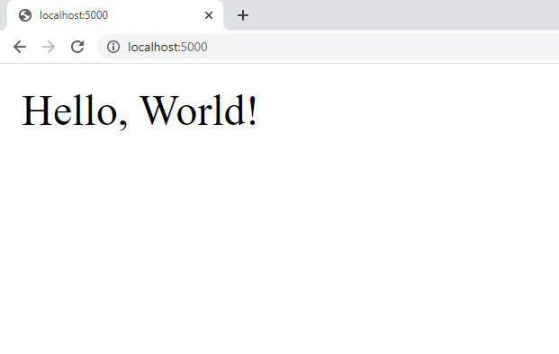

## Van HTTP naar REST met Flask

De technologie om Web-pagina's te laden wordt dus ook gebruikt om programma's met elkaar te laten praten.  
Hoe gaat we dit nu realiseren met Python?   

* **Requests** => API's aan te roepen (client)
* **Flask** => Web-applicaties en API's aanmaken

~~~
+--------------+               +--------------+
|              |               |              |
|              |<--------------+              |
|  CLIENT      |               |  SERVER      |
|  REQUESTS    |               |  FLASK       |
|              +-------------->|              |
|              |               |              |
+--------------+               +--------------+
~~~

### Installatie

In het vorige deel (modules) hadden we deze reeds geinstalleerd via pip.  Mocht dit nog niet gebeurd zijn kan je dit als volgt doen...

~~~
$ pip install flask requests
~~~

### Eerste programma

We starten met een éénvoudig, namelijk een applicatie die de string "Hello World!" teruggeeft...

~~~python
from flask import Flask

app = Flask(__name__)

@app.route('/')
def hello_world():
    return 'Hello, World!'

if __name__ == "__main__":
    app.run(port=4000, debug=True)
~~~

### Programma draaien

Om dit te draaien dien je te doen vanaf de command line

~~~
(base) bart@bvlegion:~/Tryout/demo_modules$ python demo.py 
 * Serving Flask app "demo" (lazy loading)
 * Environment: production
   WARNING: This is a development server. Do not use it in a production deployment.
   Use a production WSGI server instead.
 * Debug mode: off
 * Running on http://127.0.0.1:4000/ (Press CTRL+C to quit)
~~~

Als je dan in je browser navigeert naar http://localhost:4000/ zou je het volgende resultaat moeten krijgen.

~~~
(base) bart@bvlegion:~/Tryout/demo_modules$ python demo.py 
 * Serving Flask app "demo" (lazy loading)
 * Environment: production
   WARNING: This is a development server. Do not use it in a production deployment.
   Use a production WSGI server instead.
 * Debug mode: off
 * Running on http://127.0.0.1:4000/ (Press CTRL+C to quit)
127.0.0.1 - - [19/May/2022 18:56:44] "GET / HTTP/1.1" 200 -
127.0.0.1 - - [19/May/2022 18:56:44] "GET /favicon.ico HTTP/1.1" 404
~~~

### Ophalen van data met requests

~~~python
import requests

reply = requests.get("http://localhost:4000/")
print("Headers:", reply.headers)
print("OK or not:", reply.ok)
print("Status:", reply.status_code)
print("Content:", reply.text)
~~~

~~~
$ python client.py
Headers: {'Content-Type': 'text/html; charset=utf-8', 'Content-Length': '13', 'Server': 'Werkzeug/2.0.2 Python/3.9.7', 'Date': 'Wed, 25 May 2022 12:28:21 GMT'}
OK or not: True
Status: 200
Content: Hello, World!
~~~

### Niet bestaande resource (404)

~~~python
import requests

reply = requests.get("http://localhost:4000/notexisting")
print("Headers:", reply.headers)
print("OK or not:", reply.ok)
print("Status:", reply.status_code)
print("Content:", reply.text)
~~~

~~~
$ python client.py
Headers: {'Content-Type': 'text/html; charset=utf-8', 'Content-Length': '232', 'Server': 'Werkzeug/2.0.2 Python/3.9.7', 'Date': 'Wed, 25 May 2022 12:29:23 GMT'}
OK or not: False
Status: 404
Content: <!DOCTYPE HTML PUBLIC "-//W3C//DTD HTML 3.2 Final//EN">
<title>404 Not Found</title>
<h1>Not Found</h1>

The requested URL was not found on the server. If you entered the URL manually please check your spelling and try again.

~~~

~~~
 * Restarting with watchdog (inotify)
 * Debugger is active!
 * Debugger PIN: 240-472-653
127.0.0.1 - - [25/May/2022 14:29:23] "GET /notexisting HTTP/1.1" 404 -
~~~

### Verboden operatie (405)

~~~python
import requests

reply = requests.delete("http://localhost:4000/")
print("Headers:", reply.headers)
print("OK or not:", reply.ok)
print("Status:", reply.status_code)
print("Content:", reply.text)
~~~

~~~
$ python client.py
Headers: {'Content-Type': 'text/html; charset=utf-8', 'Allow': 'GET, HEAD, OPTIONS', 'Content-Length': '178', 'Server': 'Werkzeug/2.0.2 Python/3.9.7', 'Date': 'Wed, 25 May 2022 12:31:57 GMT'}
OK or not: False
Status: 405
Content: <!DOCTYPE HTML PUBLIC "-//W3C//DTD HTML 3.2 Final//EN">
<title>405 Method Not Allowed</title>
<h1>Method Not Allowed</h1>

The method is not allowed for the requested URL.

~~~

### Netwerk connecties

~~~python
import requests

reply = requests.get("http://localhost:5000/")
print("Headers:", reply.headers)
print("OK or not:", reply.ok)
print("Status:", reply.status_code)
print("Content:", reply.text)
~~~

~~~
$ python client.py
Traceback (most recent call last):
  File "/usr/lib/python3/dist-packages/urllib3/connection.py", line 159, in _new_conn
    conn = connection.create_connection(
  File "/usr/lib/python3/dist-packages/urllib3/util/connection.py", line 84, in create_connection
    raise err
  File "/usr/lib/python3/dist-packages/urllib3/util/connection.py", line 74, in create_connection
    sock.connect(sa)
ConnectionRefusedError: [Errno 111] Connection refused
~~~

~~~python
import requests
from urllib3 import HTTPConnectionPool

try:
    reply = requests.get("http://localhost:5000/")
    print("Headers:", reply.headers)
    print("OK or not:", reply.ok)
    print("Status:", reply.status_code)
    print("Content:", reply.text)
except BaseException as e:
    print(type(e))
~~~

~~~
$ python client.py
<class 'requests.exceptions.ConnectionError'>
~~~

~~~python
import requests
from urllib3 import HTTPConnectionPool

try:
    reply = requests.get("http://localhost:5000/")
    print("Headers:", reply.headers)
    print("OK or not:", reply.ok)
    print("Status:", reply.status_code)
    print("Content:", reply.text)
except requests.exceptions.ConnectionError as e:
    print("Network-related errors:", e)
~~~

~~~
$ python client.py
Network-related errors: HTTPConnectionPool(host='localhost', port=5000): Max retries exceeded with url: / (Caused by NewConnectionError('<urllib3.connection.HTTPConnection object at 0x7fed44d62790>: Failed to establish a new connection: [Errno 111] Connection refused')
~~~

~~~python
import requests
from urllib3 import HTTPConnectionPool

try:
    reply = requests.get("http://alocalhost:5000/")
    print("Headers:", reply.headers)
    print("OK or not:", reply.ok)
    print("Status:", reply.status_code)
    print("Content:", reply.text)
except requests.exceptions.ConnectionError as e:
    print("Network-error:", e)
~~~

~~~
Network-related errors: HTTPConnectionPool(host='alocalhost', port=4000): Max retries exceeded with url: / (Caused by NewConnectionError('<urllib3.connection.HTTPConnection object at 0x7fde46fc1790>: Failed to establish a new connection: [Errno -2] Name or service not known'))
~~~

### Werken met routes

~~~python
from flask import Flask

app = Flask(__name__)

@app.route('/')
def hello_world():
    return 'Hello, World!'

@app.route('/test')
def hello_school():
    return 'Hello, Mars!'

if __name__ == "__main__":
    app.run(port=4000, debug=True)
~~~

~~~python
import requests
from urllib3 import HTTPConnectionPool

baseuri = "http://localhost:4000/"

def get_and_print_reply(uri):
    try:
        reply = requests.get(uri)
        print("Headers:", reply.headers)
        print("OK or not:", reply.ok)
        print("Status:", reply.status_code)
        print("Content:", reply.text)
    except requests.exceptions.ConnectionError as e:
        print("Network-related errors:", e)

get_and_print_reply(baseuri)
get_and_print_reply(baseuri + "test")
~~~

~~~
$ /bin/python3 /home/bart/Tryout/demo_modules/client.py
Headers: {'Content-Type': 'text/html; charset=utf-8', 'Content-Length': '13', 'Server': 'Werkzeug/2.0.2 Python/3.9.7', 'Date': 'Wed, 25 May 2022 13:08:41 GMT'}
OK or not: True
Status: 200
Content: Hello, World!
Headers: {'Content-Type': 'text/html; charset=utf-8', 'Content-Length': '12', 'Server': 'Werkzeug/2.0.2 Python/3.9.7', 'Date': 'Wed, 25 May 2022 13:08:41 GMT'}
OK or not: True
Status: 200
Content: Hello, Mars!
~~~

### Parameter-binding

~~~python
from flask import Flask

app = Flask(__name__)

@app.route('/')
def hello_world():
    return 'Hello, World!'

@app.route('/test')
def hello_school():
    return 'Hello, Mars!'

@app.route('/user/<username>')
def profile(username):
    return f'Hello {username}'

if __name__ == "__main__":
    app.run(port=4000, debug=True)
~~~

~~~python
import requests
from urllib3 import HTTPConnectionPool

baseuri = "http://localhost:4000/"

def get_and_print_reply(uri):
    try:
        reply = requests.get(uri)
        print("Headers:", reply.headers)
        print("OK or not:", reply.ok)
        print("Status:", reply.status_code)
        print("Content:", reply.text)
    except requests.exceptions.ConnectionError as e:
        print("Network-related errors:", e)

get_and_print_reply(baseuri + "user/bart")
~~~

~~~
$ python client.py
Headers: {'Content-Type': 'text/html; charset=utf-8', 'Content-Length': '10', 'Server': 'Werkzeug/2.0.2 Python/3.9.7', 'Date': 'Wed, 25 May 2022 13:14:28 GMT'}
OK or not: True
Status: 200
Content: Hello bart
~~~

~~~python
from flask import Flask

app = Flask(__name__)

@app.route('/')
def hello_world():
    return 'Hello, World!'

@app.route('/test')
def hello_school():
    return 'Hello, Mars!'

@app.route('/user/<firstname>/<lastname>')
def profile(firstname, lastname="test"):
    return f'Hello {firstname} {lastname}'

if __name__ == "__main__":
    app.run(port=4000, debug=True)
~~~

~~~python
import requests
from urllib3 import HTTPConnectionPool

baseuri = "http://localhost:4000/"

def get_and_print_reply(uri):
    try:
        reply = requests.get(uri)
        print("Headers:", reply.headers)
        print("OK or not:", reply.ok)
        print("Status:", reply.status_code)
        print("Content:", reply.text)
    except requests.exceptions.ConnectionError as e:
        print("Network-related errors:", e)

get_and_print_reply(baseuri + "user/bart/voet")
~~~

~~~
Headers: {'Content-Type': 'text/html; charset=utf-8', 'Content-Length': '15', 'Server': 'Werkzeug/2.0.2 Python/3.9.7', 'Date': 'Wed, 25 May 2022 13:18:53 GMT'}
OK or not: True
Status: 200
Content: Hello bart voet
~~~

~~~python
import requests
from urllib3 import HTTPConnectionPool

baseuri = "http://localhost:4000/"

def get_and_print_reply(uri):
    try:
        reply = requests.get(uri)
        print("Headers:", reply.headers)
        print("OK or not:", reply.ok)
        print("Status:", reply.status_code)
        print("Content:", reply.text)
    except requests.exceptions.ConnectionError as e:
        print("Network-related errors:", e)

get_and_print_reply(baseuri + "user/bart/")
~~~

~~~
Content: Hello, World!
Headers: {'Content-Type': 'text/html; charset=utf-8', 'Content-Length': '232', 'Server': 'Werkzeug/2.0.2 Python/3.9.7', 'Date': 'Wed, 25 May 2022 13:21:42 GMT'}
OK or not: False
Status: 404
Content: <!DOCTYPE HTML PUBLIC "-//W3C//DTD HTML 3.2 Final//EN">
<title>404 Not Found</title>
<h1>Not Found</h1>

The requested URL was not found on the server. If you entered the URL manually please check your spelling and try again.

~~~

### Query-parameters

TODO

### Voorbeeld voor student

~~~python
from flask import Flask, request, url_for,jsonify, redirect
from markupsafe import escape
from students_entities import Student, StudentGroup
from students_service import *
import json

app = Flask(__name__)

@app.route('/')
def index():
    return redirect("/groups")

def group_to_json(group):
    return group.__dict__

def student_to_json(student):
    return student.__dict__

@app.route('/groups', methods=['GET'])
def groups():
    groups = list(map(group_to_json, get_groups()))
    return jsonify(groups)

# request.args.get('page', default = 1, type = int)
@app.route('/groups',  methods=['POST'])
def group_post():
    group_name = request.json["name"]
    teacher = request.json["teacher"]
    room = request.json["room"]
    save_new_group(group_name, teacher, room)
    return jsonify(group_to_json(get_group(group_name)))

@app.route('/groups/<groupname>')
def group(groupname):
    return group_to_json(get_group(groupname))

@app.route('/groups/<groupname>/students', methods=['GET'])
def students(groupname):
    above = request.args.get('above', default = None, type = int)
    if above != None:
        students = get_students_for_group_above(groupname, above)
    else:
        students = get_students_for_group(groupname)
    return jsonify(list(map(student_to_json,students)))

@app.route('/groups/<groupname>/students/<studentid>', methods=['GET'])
def student_get(groupname, studentid):
    #students = list(map(student_to_json, get_students_for_group(groupname)))
    return jsonify(student_to_json(get_student(studentid)))

@app.route('/groups/<groupname>/students', methods=['POST'])
def student_post(groupname):
    name = request.json["name"]
    lab = int(request.json["lab_points"])
    theory = int(request.json["theory_points"])
    student = save_new_student(Student(name, lab, theory), groupname)
    return jsonify(student_to_json(student))

if __name__ == "__main__":
    app.run()
~~~
