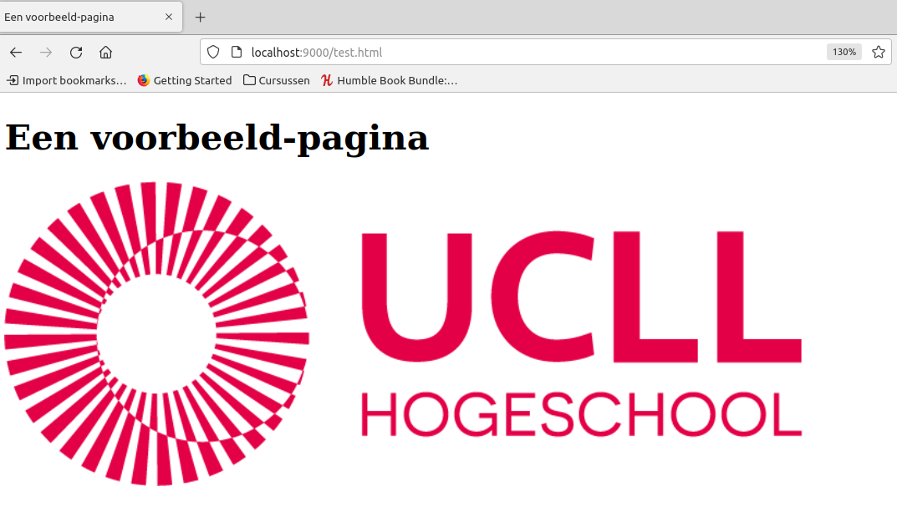

## Werken met REST en web-api's

In dit deel leggen we uit **hoe** met **web-api's** te werken we starten vanuit **client-side** met het doen dit via het **Requests-framework**, daaropvolgend zullen we naar de serverkant kijken via **Flask**-framework

Voor we aan de slag gaan bekijken we een aantal elementen die je eerst moet begrijpen:

* HTTP
* HTTP met HTML => Webpagina's
* HTTP met data (json, xml)

### HTTP

Laten we starten met HTTP.  
**HTTP** staat voor **H**yper**t**ext **T**ransfer **P**rotocol.  

**HTTP** behoor tot **layer 7** van het **OSI**-model.  
Het protocol wordt typisch "ge-exposed" over port 80 (in development dikwijls over 8080 of 5000), de secure versie HTTPS over 443

Het betreft een **applicatie-netwerk-protocol** (client-server) dat wordt gebruikt om **resources** van een server af te halen.

~~~
    +----------------------+
    | 7   APPLICATION      |   ==>  HTTP
    +----------------------+
    | 6   PRESENTATION     |   ==>  ENCODERINGEN
    +----------------------+
    | 5   SESSION          |   ==>  AUTHENTICATIE, SESSIES, ...
    +----------------------+
    | 4   TRANSPORT        |   ==> TCP, UDP, ...
    +----------------------+
    | 3   NETWORK          |   ==> ROUTER-LEVEL (IP)
    +----------------------+
    | 2   DATA LINK        |   ==> SWITCH-LEVEL (MAC)
    +----------------------+
    | 1   PHYSICAL         |   ==> TRANSMISSION OVER CABLE
    +----------------------+
~~~

Deze **resources** kunnen van alles zijn.  
Historisch waren dit vooral **resources** nodig om webpagina te laden (html, images, videos, ...).  

Vandaag wordt HTTP via REST ook zeer veel gebruikt om data van een server af te halen.  

~~~
 +--------+   --request-->     +--------+   html   gif
 | client |                    | server |   json   png
 +--------+   <--repy--        +--------+   xml    ...
~~~

### Browsers, HTTP en HTML

Een eerste vorm van applicaties die HTTP gebruiken zijn browsers (Firefox, Chrome, ...) waarmee een **gebruiker** **webpagina**'s en bijhorende resources (zoals afbeeldingen en videos) kan afhalen.  

~~~
    \O/                     +---------+   --request-->     +----------+   
     |  ======= url ======> | BROWSER |  BROWSERCONTENT    |  SERVER  |   
    / \ bv. www.google.com  +---------+  <--response--     +----------+   
~~~

Dit gebeurt meestal via **HTML-pagina's** (statisch of dynamisch gegenereerd).  
**HTML** is de standaard **markup**-taal voor **web-paginas** en staat voor **H**yper**T**ext **M**arkup **L**anguage

Een heel **éénvoudig voorbeeld** vind je hieronder:

~~~html
<!DOCTYPE html>
<html>
    <body>
        <title>Een voorbeeld-pagina</title>
    </body>
    <head>
        <h1>Een voorbeeld-pagina</h1>
        
    </head>
</html>
~~~

**Naast** het eigenlijke **document** zal de **browser** (na het parsen van het document) ook
de bijhorende elementen (nodig voor visualisatie) die verwezen worden binnen de html - zoals **images** en **videos** - 
downloaden en displayen binnen het browserscherm.

~~~
 +----------+                    +-------------+
 | browser  |                    |    server   |
 +----------+                    +-------------+
 | (1)      |   --request-->     | /hello.html |
 | DOWNLOAD |  GET hello.html    |             |
 | HTML     |  <--response--     |             |   
 |          |                    |             |
 | (2)      |                    |             |
 | ...      |                    |             |
 | PARSING  |                    |             |
 | HTML     |                    |             |
 | ...      |                    |             |
 |          |                    |             |
 | (3)      |   --request-->     | /hello.png  |
 | DOWNLOAD |  GET hello.png     |             |
 | IMAGE    |  <--response--     |             |
 +----------+                    +-------------+
~~~

### HTTP en HTML in actie

Als je graag dit eens wil testen kan je een kleine webserver maken die 
statische resources serveert...

> Voor het volledige verhaal zie https://docs.python.org/3/library/http.server.html

#### Stap 1: maak een html-file aan

Maak een file test.html aan en kopieer de onderstaande inhoud (html-code) in deze file

~~~html
<!DOCTYPE html>
<html>
    <body>
        <title>Een voorbeeld-pagina</title>
    </body>
    <head>
        <h1>Een voorbeeld-pagina</h1>
        
    </head>
</html>
~~~

Het gemakkelijkste is een lokale html-file aan te maken...

~~~
bart@bvlegion:~/Tryout$ mkdir http_py_server
bart@bvlegion:~/Tryout$ cd http_py_server/
bart@bvlegion:~/Tryout/http_py_server$ vi test.html
...
~~~

#### Stap 2: voeg een hello.png toe

De img-tag zal er voor zorgen dan een image-file wordt gedownload en de image op het scherm wordt gedisplayed.  
Hiervoor moet je er voor zorgen dat je - in dezelfde folder - een png-file plaatst met de naam hello.png (of je wijzigt de naam binnen de html).  

Je kan hier eventueel een arbitraire png van het internet plukken zoals bijvoorbeeld https://www.ucll.be/sites/default/files/documents/algemeen/logo/logo_ucll_rgb.png

~~~
bart@bvlegion:~/Tryout/http_py_server$ wget https://www.ucll.be/sites/default/files/documents/algemeen/logo/logo_ucll_rgb.png
--2022-04-26 23:32:14--  https://www.ucll.be/sites/default/files/documents/algemeen/logo/logo_ucll_rgb.png
Resolving www.ucll.be (www.ucll.be)... 193.190.138.131
Connecting to www.ucll.be (www.ucll.be)|193.190.138.131|:443... connected.
HTTP request sent, awaiting response... 200 OK
Length: 26155 (26K) [image/png]
Saving to: ‘logo_ucll_rgb.png’

logo_ucll_rgb.png                                           100%[=========================================================================================================================================>]  25,54K  --.-KB/s    in 0,01s   

2022-04-26 23:32:15 (2,20 MB/s) - ‘logo_ucll_rgb.png’ saved [26155/26155]

bart@bvlegion:~/Tryout/http_py_server$ ls
logo_ucll_rgb.png  test.html
~~~

En je "renamed" de file naar de zelfde naam dan in de html-code staat

~~~
bart@bvlegion:~/Tryout/http_py_server$ mv logo_ucll_rgb.png hello.png
bart@bvlegion:~/Tryout/http_py_server$ ls
hello.png  test.html
~~~

#### Stap 3: start je web-applicatie

Navigeer naar de command-line en voer het volgende python-commando uit:

~~~
bart@bvlegion:~/Tryout/http_py_server$ python -m http.server 9000
Serving HTTP on 0.0.0.0 port 9000 (http://0.0.0.0:9000/) ...
~~~

Dit zal een lokale webserver opstarten op de poort 9000.

> Waarschuwing: gebruik dit niet voor productie-applicaties

#### Stap 4: test via een webrowser

Als laatste stap open je de url http://localhost:9000/test.html in een browser-scherm en dan zou je volgend resultaat moeten krijgen....

Aan de kant van de server zie je dat de http-server 2 files heeft verstuurd naar de browser.

~~~
bart@bvlegion:~/Tryout/http_py_server$ python -m http.server 9000
Serving HTTP on 0.0.0.0 port 9000 (http://0.0.0.0:9000/) ...
127.0.0.1 - - [26/Apr/2022 23:43:18] "GET /test.html HTTP/1.1" 200 -
127.0.0.1 - - [26/Apr/2022 23:43:18] "GET /hello.png HTTP/1.1" 200 -
~~~

Een wireshark-trace toont je dat firefox 2 request/reply interacties heeft:

* Een 1ste voor de html-file
* Een 2de voor de png-file

~~~
546	69.372822126	127.0.0.1	127.0.0.1	HTTP	519	GET /test.html HTTP/1.1 
550	69.374803049	127.0.0.1	127.0.0.1	HTTP	257	HTTP/1.0 200 OK  (text/html)
558	69.432336639	127.0.0.1	127.0.0.1	HTTP	454	GET /hello.png HTTP/1.1 
562	69.432966252	127.0.0.1	127.0.0.1	HTTP	26223	HTTP/1.0 200 OK  (PNG)
~~~

### HTTP-protocol

Een webpagina of andere resource wordt van een server afgehaald door middel van HTTP.  
Hoe ziet zo'n HTTP request/reply er nu uit?

Zowel de request en reply bestaan elk uit een **header** en **body**

~~~
                +-----------------------------------+
                |         HTTP                      |
+-------+-------+----------+------------------------+
|       |       |          |                        |
|  TCP  |  IP   |  HEADER  |         BODY           |
|       |       |          |                        |
+-------+-------+----------+------------------------+
                           |      OPTIONEEL         |                         
                           +------------------------+ 

~~~

Deze **body** is optioneel en bevat de **payload**.  
Dit kan een stuk tekst zijn igv html maar kan ook een andere een png-file, video, ...

De **header** daarentegen is altijd verplicht en bevat de nodige metadata nodig om deze uitwisseling te voltooien.  

#### HTTP-request

In onderstaand dump (Wireshark) zie je de browser die een file test.html aanvraagt.  

~~~
GET /test.html HTTP/1.1
Host: localhost:9000
User-Agent: Mozilla/5.0 (X11; Linux x86_64; rv:99.0) Gecko/20100101 Firefox/99.0
Accept: text/html,application/xhtml+xml,application/xml;q=0.9,image/avif,image/webp,*/*;q=0.8
Accept-Language: en-US,en;q=0.5
Accept-Encoding: gzip, deflate, br
DNT: 1
Connection: keep-alive
Upgrade-Insecure-Requests: 1
Sec-Fetch-Dest: document
Sec-Fetch-Mode: navigate
Sec-Fetch-Site: none
Sec-Fetch-User: ?1
~~~

De **eerste lijn** is de belangrijkste, deze geeft aan welke **resource** en welke **operatie** er dient op uitgevoerd worden.  
Daarnaast wordt er nog wat bijkomende informatie verschaft met het formaat...

~~~
<header-field>: <inhoud>
~~~

...met onder andere de volgende info

* Over HTTP 1.1-protcol
* De host is localhost
* Met port 9000
* De browser duidt aan dat die een aantal formaten aanvaardt via de accept-clausule
* ...

#### De HTTP-reply

Bij de HTTP-reply is de eerste lijn ook de belangrijkste.  
Deze geeft namelijk de status aan van de operatie, in onderstaand voorbeeld is deze OK (bevestiging dat de operatie geslaagd is)

~~~
HTTP/1.0 200 OK
Server: SimpleHTTP/0.6 Python/3.9.7
Date: Tue, 26 Apr 2022 21:48:58 GMT
Content-type: text/html
Content-Length: 189
Last-Modified: Tue, 26 Apr 2022 21:31:30 GMT
<html>
    <body>
        <title>Een voorbeeld-pagina</title>
    </body>
    <head>
        <h1>Een voorbeeld-pagina</h1>
        
    </head>
</html>
~~~

Daarnaast geeft deze onder andere  krijgt een reply:

* Het content-type (text-html)
* Een datum van aanmaak hetgeen gebruikt wordt voor caching
* De eigenlijke content onderaan de http-message

#### Method (HTTP-REQUEST)

Essentieel om een HTTP (en zo direct REST) te verstaan is dat er verschillende operaties mogelijk zijn.  
We hadden onder andere al de GET-method gezien, maar er zijn heel wat andere methods of operaties mogelijk.  

De 4 belangrijkste die wij zullen gebruiken zijn uiteindelijk.  
Je kan deze operaties een beetje vergelijken met de CRUD-operaties op een database die we eerder hebben gezien:

* **GET**  
  Met deze operatie vraag je een resourse/document op van de server.  
  Binnen CRUD kan je dit als een **read** beschouwen
* **POST**  
  Dit overschrijft of maakt een **nieuwe resource** aan.   
  Dit wordt beschouwd als een **create**
* **PUT** 
  Dit **wijzigt** een **resource** (meestal via een webform).  
  Dit wordt beschouwd als een **update**
* **DELETE** => verwijderd een resource

> Voor een vollediger overzicht zie:
>
> * https://www.w3schools.com/tags/ref_httpmethods.asp
> * https://developer.mozilla.org/en-US/docs/Web/HTTP?retiredLocale=nl
> * https://www.w3.org/Protocols/Specs.html

##### Praktisch voorbeeld

Als voorbeeld een praktisch voorbeeld dat we in de praktijk gaan proberen te brengen
wanneer we met Flask gaan proberen een REST-based studenten-applicatie te schrijven.

Als je dit zou toepassen krijg je volgende mapping.

| Beschrijving                              | Method | Endpoint      | Idempotent |
|-------------------------------------------|--------|---------------|------------|
| Maak een student aan                      | POST   | /student      | Nee        |
| Vraag de info over een student            | GET    | /student/{id} | Ja         |
| Pas een student zijn data aan (bv.punten) | PUT    | /student/{id} | Ja         |
| Verwijder een student uit database        | DELETE | /student/{id} | Ja         |

#### STATUS (HTTP-REPLY)

Een **status** is naast de eigenlijke **reply-body** het belangrijkste onderdeel.  
Het geeft namelijk 2 stukken info door:

* Is de operatie geslaagd
* Wat is er met gebeurd

De status-codes kan je opdelen in 4 groepen afhankelijk van hun hondertal.  
Codes die starten met het onderstaande getal geven aan dat:

* 2XX => OK, de operatie is geslaagd
* 3XX => INFO, dit kan bijvoorbeeld een redirect zijn (ander endpoint)
* 4XX => FOUT VAN JOU, je hebt bijvoorbeeld een niet bestaande pagina geselecteerd
* 5XX => FOUT VAN DE SERVER, er is een interne fout op de server

De meest belangrijke:

* 2XX
  * 200 **OK** – Het gevraagde document is succesvol opgevraagd.
* 3XX
  * 301 **Redirect** - De informatie bevindt zich in een andere resource (je browser zal dan deze resource gaan ophalen)
  * 304 **Not Modified** – T.o.v. de versie in de cache is de pagina niet gewijzigd.
* 4XX
  * 400 **Bad Request** - De gebruiker heeft een fout gemaakt in het verzoek waardoor deze niet verwerkt kan worden.
  * 403 **Forbidden** – Het opgevraagde document mag niet opgevraagd worden.
  * 404 **Not Found** – Het opgevraagde document bestaat niet.
  * 405 **Method Not Allowed** – De gebruikte requestmethode is niet toegestaan.
  * 410 **Gone** – Het opgevraagde document heeft bestaan maar is niet meer beschikbaar. Vergelijkbaar met foutcode 404.
  * 451 **Unavailable** For Legal Reasons - een website niet kan worden weergegeven vanwege juridische redenen
* 5XX
  * 500 **Internal Server Error** – De webserver heeft de gevraagde actie niet kunnen uitvoeren.
  * 503 **Service Temporarily Unavailable** – De webserver is tijdelijk in onderhoud.

Als je bijvoorbeeld een refresh van je pagina uitvoert zie je dat de server een 304 teruggeeft:

~~~
(base) bart@bvlegion:~/Tryout/http_py_server$ python -m http.server 9000
Serving HTTP on 0.0.0.0 port 9000 (http://0.0.0.0:9000/) ...
127.0.0.1 - - [26/Apr/2022 23:43:18] "GET /test.html HTTP/1.1" 200 -
127.0.0.1 - - [26/Apr/2022 23:43:18] "GET /hello.png HTTP/1.1" 200 -
127.0.0.1 - - [26/Apr/2022 23:48:01] "GET /test.html HTTP/1.1" 304 -
127.0.0.1 - - [26/Apr/2022 23:48:01] "GET /hello.png HTTP/1.1" 304 -
~~~

### Wat is een API?

We gaan echter niet op de webpagina's gaan maken maar op API's.  

Een API OF **A**pplication **P**rogramming **I**nterface (API) is een verzameling van operaties of functies 
die je tussen 2 stukken software of applicaties kan definieren.  

De API's waar wij over spreken zijn network-API's en in deze cursus meer specifiek REST-API's

### Web-API'S

Tot hier gebruikten we als **gebruiker** - via een browser - het **http-protocol** om **(html-)resources** 
op te halen van een server.

~~~
    \O/                     +---------+   --request-->     +----------+   
     |  ======= url ======> | BROWSER |  BROWSERCONTENT    |  SERVER  |   
    / \ bv. www.google.com  +---------+  <--response--     +----------+   
~~~

HTTP kan echter ook gebruikt worden in andere scenario's om data op te halen (ipv visuele content) 

~~~
                 (1)                        (2)
    +--------+  --request-->  +--------+   --request-->  +------------+   
    | SENSOR |      DATA      | SERVER |       DATA      | APPLICATIE |
    +--------+  <--response-- +--------+  <--response--  +------------+ 
                                                         (bv. dashboard)
~~~

Een typisch voorbeeld-scenario is waar 1 of meerdere sensoren (of een embedded device met een sensor gekoppeld aan is)
sensor-data doorstuurt naar een server in de cloud.  

Aan de andere kant zal een andere applicatie (zoals bijvoorbeeld een dashboard) deze data (die wordt bijgehouden op de server) probeert af te halen.  
Dit is een veel voorkomend patroon binnen IoT.

Zulke API's die beschikbaar zijn op het web (of cloud), noemen we Web-API's.  
Laten we een aantal elementen bekijken die we gaan gebruiken binnen het gebruik van deze API's

#### REST (structuur van API)

De meeste API's die je gaat gebruiken het principe van REST of RESTFull design.  
Dit is niet noodzakelijk een protocol maar eerder een (architecturele) stijl van hoe dat je data (of "resources") ordent.

De basisprincipes:

* Je gebruikt de HTTP-methodes (POST, GET, PUT, DELETE) om CRUD-operaties uit te voeren
* Je entiteiten worden voorgesteld als http-resources
* Deze resources worden binnen de URL hiërarchisch geordend

Stel bijvoorbeeld dat je een REST-api gaat maken om een school te beheren waar je:

* Klassen kan beheren
* Studenten aan deze klassen kunt toevoegen bewerken

~~~
grop: 1
    student: 1
    student: 2
~~~

Om dit te illustreren, zo dadelijk gaan we een applicatie maken.  
Laten we kijken hoe we deze zouden gebruiken door middel van curl 
(tool om http-requests uit te voeren vanuit linux)

> We gaan zo dadelijk het zelfde doen via de Requests-library
> dus er er is geen nood om curl te installeren

Stel als je een overzicht wil krijgen van de klasgroepen.  
ga je naar het endpoint groups.

> Zo'n eindpoint is het path relatief aan je host/domainame
> In de url hieronder:
>
> * http => protocol
> * localhost => domain of sever-naam (zie dns)
> * 5000 => poort waar je app op luistert
> * groups => alles wat er op volgt

We starten bijvoorbeeld met alle groepen op te lijsten:

~~~bash
$ curl http://localhost:5000/groups
~~~

Dit geeft een json-lijst met alle groepen.

~~~json
[{"name":"1","room":"D114","teacher":"BV"},
 {"name":"hello","room":"D118","teacher":"Jos"}]
~~~

We zien hier 2 groepen: 1 en hello.  
Als we enkel groep 1 hebben kunnen we nu filteren op 1.  
Dit zet je dan na de entiteits-naam "groups"

~~~bash
$ curl http://localhost:5000/groups/1
~~~

met als resultaat

~~~json
{"name":"1","room":"D114","teacher":"BV"}
~~~

Studenten vallen in onze school onder een groep.  
Als je alle studenten wil zien uit groep 1 schrijf je de entiteit-naam (students) achter voorgaand path

~~~bash
$ curl http://localhost:5000/groups/1/students
~~~

met als resultaat

~~~json
[{"lab_points":10,"name":"aa","student_id":1,"theory_points":20},
 {"lab_points":10,"name":"bb","student_id":2,"theory_points":15},
 {"lab_points":10,"name":"cc","student_id":3,"theory_points":15},
 {"lab_points":12,"name":"dd","student_id":4,"theory_points":15},
 {"lab_points":15,"name":"cc","student_id":5,"theory_points":16},
 {"lab_points":12,"name":"ff","student_id":6,"theory_points":20}]
~~~

Als je enkel student 2 wil zijn kan je dat opnieuw filteren adhv haar/zijn id

~~~bash
curl http://localhost:5000/groups/1/students/2
~~~

met als resultaat

~~~json
{"lab_points":10,"name":"bb","student_id":2,"theory_points":15}
~~~

Het is ook mogelijk dat je in je api query-parameters voorzien.  
Met de query-parameter above hebben we in de api nu voorzien van te filteren op studenten die punten > 15 hebben.

Het onderstaande voorbeeld...

~~~bash
$ curl http://localhost:5000/groups/1/students?above=15
~~~

...zorgt er voor dat je de lijst van studenten wordt beperkt

~~~json
[{"lab_points":10,"name":"aa","student_id":1,"theory_points":20},
 {"lab_points":15,"name":"cc","student_id":5,"theory_points":16},
 {"lab_points":12,"name":"ff","student_id":6,"theory_points":20}]
~~~

Als we nu een student willen toevoegen kan je 

~~~
$ curl -d  '{"lab_points":12,"name":"Filip van Saksen-Coburg","theory_points":15}'  -X POST -H "Content-Type: application/json" -X POST http://localhost:5000/groups/1/students
{"id":7,"lab_points":12,"name":"Filip van Saksen-Coburg","student_id":0,"theory_points":15}
~~~

~~~bash
$ curl http://localhost:5000/groups/1/students
~~~

~~~json
[{"lab_points":10,"name":"aa","student_id":1,"theory_points":20},
{"lab_points":10,"name":"bb","student_id":2,"theory_points":15},
{"lab_points":10,"name":"cc","student_id":3,"theory_points":15},
{"lab_points":12,"name":"dd","student_id":4,"theory_points":15},
{"lab_points":15,"name":"cc","student_id":5,"theory_points":16},
{"lab_points":12,"name":"ff","student_id":6,"theory_points":20},
{"lab_points":12,"name":"Filip van Saksen-Coburg","student_id":7,"theory_points":15}]
~~~

