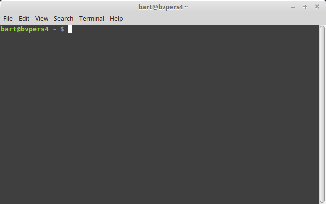

## Terminals on Linux en Mac (Bash)

Linux en Mac gebruiken beide bash als terminal.   
Ondanks het feit dat sommige commando's bekend voorkomen uit de DOS-prompt, zijn er grote verschillen te bemerken tussen beide terminal-omgevingen.

We gaan nu een overzicht maken van de meest gebruikte commando en principes.  
We doen dit aan de hand van hetzelfde voorbeeld, dat we achteraf terug gebruiken voor onze eerste oefening met een compiler.  

### Bash-shell openen

Linux en Max hebben verschillende programma's waarmee je toegang kan hebben tot de shell.

Eenmaal gestart krijg je een scherm zoals hieronder:  

~~~bash
bart@bvpers4 ~ $
~~~

Deze **prompt** :

* geeft mee welke **user** ingelogd is
* geeft aan welk **path** momenteel is gereferenceerd  
  (in dit geval komt ~ overeen met de home-directory van de user)
* geeft je mogelijkheid om een **commando** in te typen

### File en directories

#### Een directory aanmaken

We starten met het aanmaken van een **directory** waarin we onze C-code gaan plaatsen.

~~~bash
bart@bvpers4 ~ $ mkdir een_eerste_programma
bart@bvpers4 ~ $ ls
... een_eerste_programma Documents Games ...
~~~

Hier zien we in 1 klap 2 commando's:

* **mkdir** gevolg door het path **een_eerste_programma**  
  Dit maakt een nieuwe folder of directory deze naam.  
* Het commando **ls**  
  Laat ons toe de **inhoud** na te kijken van de huidige **directory**

#### Navigeren door directories

Als je deze directory hebt aangemaakt kan je hiernaartoe navigeren via het commando **cd**  
(hetgeen staat voor change directory)

~~~bash
bart@bvpers4 ~ $ cd een_eerste_programma
bart@bvpers4 ~/een_eerste_programma $ pwd
/home/bart/een_eerste_programma
bart@bvpers4 ~/een_eerste_programma $
~~~

Het gebruik is éénvoudig, je navigeert door cd te typen gevolgd door het path naar deze directory.  
Het commando **pwd** print in dit geval de gehele huidige directory af.  

#### Relatieve vs absolute path

*mkdir* en *cd* nemen - net zoals de meeste commando's op de DOS-prompt - als input een **path**.    
Zo'n path is de verwijzing naar een (target-)directory waarop je dit commando wil op uitvoeren.  

Er zijn een aantal manieren waarop je een path kan construeren, het grootste onderscheid dat we hier maken is  absoluut of relatief:

* **absoluut** is een path dat start vanaf de root-directory, dit path start namelijk vanaf de schijf waar je wil naar verwijzen

~~~bash
bart@bvpers4 ~ $ cd /home/bart/een_eerste_programma
bart@bvpers4 ~/een_eerste_programma $ pwd
/home/bart/een_eerste_programma
bart@bvpers4 ~/een_eerste_programma $
~~~

Dit start altijd me een verwijzing naar de root-directory

* **relatief** verwijst naar een locatie relatief naar je huidige directory

~~~bash
bart@bvpers4 ~ $ cd een_eerste_programma
bart@bvpers4 ~/een_eerste_programma $ pwd
/home/bart/een_eerste_programma
bart@bvpers4 ~/een_eerste_programma $ cd ../een_andere_directory
bart@bvpers4 ~/een_andere_directory $
~~~

Dit verwijst van je huidige directory naar een path relatief tov je huidige directory.  
Het symbool **..** (2 dots na elkaar) kan je altijd gebruiken om naar de super-directory te verwijzen

#### Home-directory

Elke user op unix-systemen heeft een home-directory, in bash kan je daarna verwijzen met het teken ~  
Ook cd typen zonder iets zorgt dat je in de home-directory geraakt

~~~bash
bart@bvpers4 ~ $ cd ..
bart@bvpers4 /home $ cd
bart@bvpers4 ~ $ pwd
/home/bart
bart@bvpers4 ~ $ cd ..
bart@bvpers4 /home $ cd ~
bart@bvpers4 ~ $ pwd
/home/bart
bart@bvpers4 ~ $
~~~

#### Directories verwijderen

Een directory kan verwijderd worden door het commando rmdir.  
Deze directory mag wel geen files bevatten anders zal deze een fout-code opleveren

~~~bash
bart@bvpers4 ~ $ rmdir een_eerste_programma
bart@bvpers4 ~ $ cd een_eerste_programma
bash: cd: een_eerste_programma: No such file or directory
~~~

Als je nadien naar deze directory probeert te gaan krijg je een boodschap dat deze directory niet bestaat.

#### Files in een directory

We maken opnieuw een directory aan, deze keer navigeren we ook naar deze directory.

~~~bash
bart@bvpers4 ~ $ cd mijn_eerste_programma/
bart@bvpers4 ~/mijn_eerste_programma $ ls
bart@bvpers4 ~/mijn_eerste_programma $
~~~

Vervolgens maken we via een **texteditor** (bijvoorbeeld gedit zoals eerder besproken) aan, en copieren we volgende inhoud  naar een file:

~~~c
print("Hello World")
~~~

Deze file bewaren we onder de eerder aangemaakte directory onder de naam hello.py.  
Nadien kijken we na met het ls-commando of deze file correct is aangemaakt.  

~~~bash
bart@bvpers4 ~/mijn_eerste_programma $ ls
hello.py
~~~

#### Inhoud van een file tonen op command-line

Stel dat je deze file alleen wil lezen bestaat er ook de mogelijkheid vanuit de command-line deze file te lezen.  
Dit kan door de inhoud van deze file naar de command-line af te drukken via het commmando **cat**

~~~bash
bart@bvpers4 ~/mijn_eerste_programma $ cat hello.c
print("Hello World")
~~~

#### Copieren van een file

Je kan ook een file via de terminal copieren via het commando COPY

~~~bash
bart@bvpers4 ~/mijn_eerste_programma $ cp hello.py hello.txt
bart@bvpers4 ~/mijn_eerste_programma $ ls
hello.py hello.txt
~~~

#### Verwijderen van een file

Gezien we deze file niet nodig hebben (voor het vervolg van onze cursus) gaan we deze verwijderen.  
We gebruiken hiervoor het **rm**-commando op nieuw gevolgd door het path naar deze file.

~~~bash
bart@bvpers4 ~/mijn_eerste_programma $ ls
hello.py hello.txt
bart@bvpers4 ~/mijn_eerste_programma $ rm hello.txt
bart@bvpers4 ~/mijn_eerste_programma $ ls
hello.py
~~~
> **Nota:**  
> Net zoals bij andere commando's kan je een file aanduiden met zowel een relatief als een absoluut path

### Uitvoeren van programma's

Naast het bekijken en manipuleren van je file-systeem kan je ook programma's uit voeren.  
Bijvoorbeeld onderstaand voorbeeld voert de python-interpreter uit met als argument de python-file

~~~bash
bart@bvpers4 ~/mijn_eerste_programma $ ls
hello.py
bart@bvpers4 ~/mijn_eerste_programma $ python hello.py
Hello World
~~~

### Environment-variabelen

Een shell laat toe om - zoals in een programmmeer-taal - variabelen aan te maken en te gebruiken.

### Een environment-variabele definieren

Een environment-variabele is een variabele (eigenlijk een stuk tekst) die door de shell wordt bijgehouden gedurende de terminal-sessie.  

Het volgende voorbeeld gebruikt bijvoorbeeld dit mechanisme om een het path naar je project bij te houden

~~~
bart@bvpers4 ~ $ MIJN_PROJECT=/home/bart/mijn_eerste_programma
bart@bvpers4 ~ $ echo $MIJN_PROJECT
/home/bart/mijn_eerste_programma
bart@bvpers4 ~ $ cd $MIJN_PROJECT
bart@bvpers4 ~/mijn_eerste_programma $

~~~

* Zo'n variabele kan je initialiseren via door de **naam** van deze variabele
* Te verbinden via een **=**-teken aan een tekst
* Je kan de inhoud van zo'n **variabele** afdrukken naar de console met het commando **echo**  
  (gevolgd door de naam voorafgegaan door een $-teken)
* Je kan de inhoud hergebruiken bij andere commando's door deze naam te laten voorgaan door een **$**-terugkomen   
  (de shell zal dan de tekst achter deze variabele vervangen)

> **Let op**, als deze variabele al bestaat dan wordt deze overschreven

#### Systeem-variabelen

Naast je eigen variabelen houdt je operating systeem ook een aantal variabelen bij.  

~~~bash
bart@bvpers4 ~ $ cd een_directory_die_niet_bestaat
bart@bvpers4 ~ $ echo $?
1
bart@bvpers4 ~ $ cd mijn_eerste_programma/
bart@bvpers4 ~/mijn_eerste_programma $ echo $?
0
~~~

Deze variabele $? zal de error-code bijhouden die door het laatste programma was teruggegeven aan de shell.  

### Alle environment-variabelen zien

Als je alle variabelen willen zien moet je gewoon het commando printenv typen

~~~
bart@bvpers4 ~/mijn_eerste_programma $ printenv
LC_PAPER=de_BE.UTF-8
XDG_VTNR=8
SSH_AGENT_PID=2713
XDG_SESSION_ID=c1
LC_ADDRESS=de_BE.UTF-8
LC_MONETARY=de_BE.UTF-8
COMP_WORDBREAKS= 	
"'><;|&(:
QT_STYLE_OVERRIDE=gtk
GPG_AGENT_INFO=/home/bart/.gnupg/S.gpg-agent:0:1
TERM=xterm-256color
...
~~~
